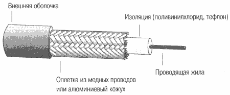

# Электрические кабели для локальных сетей: основные типы и их характеристики

Кабель состоит из проводников, слоев экрана и изоляции. Также в состав кабеля входят разъемы для подключения его к сетевому оборудованию.

В компьютерных сетях применяются кабели, которые удовлетворяют определенным стандартам. Это позволяет строить сеть из кабелей и cоединительных устройств разных производителей, а не мучиться подбором всех компонентов одного производителя.

Наиболее употребительные стандарты на сегодняшний момент - американский стандарт EIA/TIA-568A, международный стандарт ISO/IEC 11801, европейский стандарт EN50173 и фирменный стандарт компании IBM.

Стандарты определены для 4-х типов кабелей:

* на основе неэкранированной витой пары
* экранированной витой пары
* коаксиального
* волоконно-оптического кабелей

### Витая пара (twisted pair)

Представляет собой одну или несколько пар изолированных проводников, скрученных между собой, для уменьшения взаимных наводок при передаче сигнала, и покрытых пластиковой оболочкой. Используется в телекоммуникациях и в компьютерных сетях в качестве сетевого носителя во многих технологиях, таких как Ethernet, ARCNet и Token ring.

В настоящее время, благодаря своей дешевизне и лёгкости в установке, является самым распространённым для построения локальных сетей.

В зависимости от наличия защиты — электрически заземлённой медной оплетки или алюминиевой фольги вокруг скрученных пар, определяют разновидности данной технологии:

* неэкранированная витая пара (UTP — Unshielded Twisted Pair)
* экранированная витая пара (STP — Shielded Twisted Pair)
* фольгированная витая пара (FTP — Foiled Twisted Pair)
* фольгированная экранированная витая пара (SFTP — Shielded Foiled Twisted Pair) 

В некоторых типах экранированного кабеля защита может использоваться ещё и вокруг каждой пары, индивидуальное экранирование. Экранирование обеспечивает лучшую защиту от электромагнитных наводок как внешних, так и внутренних, и т. д.

В дополнение к этому кабель применяется одно- и многожильный. В первом случае каждый провод состоит из одной медной жилы, а во втором - из нескольких.

Одножильный кабель не предполагает прямых контактов с подключаемой периферией. То есть, как правило, его применяют для прокладки в коробах, стенах и т.д. с последующим оконечиванием розетками. Связано это с тем, что медные жилы довольно толсты и при частых изгибах быстро ломаются. Однако для "врезания" в разъемы панелей розеток такие жилы подходят как нельзя лучше. В свою очередь многожильный кабель плохо переносит "врезание" в разъемы панелей розеток (тонкие жилы разрезаются), но замечательно ведет себя при изгибах и скручиваниях. Поэтому многожильный кабель используют в основном для изготовления патчкордов (PatchCord), соединяющих периферию с розетками.

Кабели на основе витой пары медные неэкранированные делятся по своим электромеханическим свойствам на 5 категорий:

1. Применяется в случаях, где требования к скорости передачи данных минимальны. Обычно используется для аналоговой и цифровой передачи голоса и низкоскоростной передачи данных
2. Впервые был использован фирмой IBM для построения своей собственной кабельной системы. Основное требование - передача сигналов со спектром 1 МГц. Способен передавать данные до 4 Мбит/с.
3. Стандартизован в 1991 году (EIA-568, EIA-568A). Стандарт определил электрические харатеристики кабеля для частоты 16 МГц. Способен передавать данные до 10 Мбит/с.
4. Улучшенный вариант предыдущей категории. Этот кабель должен выдерживать тесты на частоте передачи сигнала 20 МГц, при этом обеспечивать хорошую помехоустойчивость и низкие потери сигнала. Эта категория хорошо подходит для систем с увеличенным до 135 метров расстоянием, а также в сетях Token Ring с пропускной способностью 16 Мбит/с. Однако на практике почти не используется.
5. Специально разработан для поддержки высокоскоростных протоколов. Их характеристики определяются в диапазоне до 100 МГц. На кабель категории 5 ориентированно большинство высокоскоростных стандартов. С ним работают протоколы со скоростью передачи данных 100 Мбит/с FDDI с физическим стандартом TP-PMD, Fast Ethernet, 100VGAnyLAN и более скоростные протоколы АТМ со скоростью 155 Мбит/с , а также вариант 
Gigabit Ethernet со скоростью 1000 Мбит/с. Вариант Gigabit Ethernet на основе витой пары с использованием 4-жильного кабеля UTP стал стандартом в 1999 году. Кабель категории 5 пришел на смену третьей категории, и в настоящее время кабельные системы крупных зданий строятся
на этом типе кабеля в сочетании с волоконно-оптическим. Кабели UTP выпускаются в 2- и 4-парном исполнении. Каждая пара такого кабеля имеет
свой шаг скрутки и определенный цвет. В 4-парном исполнении две пары предназначены для передачи данных и еще две для передачи голоса.
Для соединения кабелей используются розетки и вилки RJ-45, которые представляют собой восьмиконтактные разъемы и внешне похожи на телефонные разъемы.
6. Характеристики определяются до частоты 200 МГц, может быть как экранируемым, так и нет.
7. До 600 МГц. Обязательно экранируется, причем как каждая пара в отдельности, так и весь кабель в целом. Основное назначение этого кабеля - поддержка высокоскоростных протоколов на отрезках кабеля большей длины, чем UTP-кабель категории 5, максимальная длина сегмента которого не должна превышать 100 метров. Кабель категории 7 вряд ли целесообразен к применению: стоимость сети на его основе близка к стоимости сети на оптоволокне, а характеристики оптоволоконных кабелей выше. Поэтому, вероятно, в ближайшем будущем он постепенно уйдет, оставшись только в истории развития кабелей.

### Коаксиальный кабель

Состоит из медной жилы, изоляции, окружающей ее, экрана в виде металлической оплетки и внешней оболочки. Если кабель, кроме металлической оплетки, имеет и слой фольги, он называется  кабелем с двойной экранизацией. При наличии сильных помех можно воспользоваться кабели с учетверенной экранизацией. Он состоит из двойного слоя фольги и двойного слоя металлической оплетки.

Жила — это один провод или пучок проводов. Оплетка играет роль заземления и защищает жилу от электрических шумов и перекрестных помех. Проводящая жила и металлическая оплетка не должны соприкасаться, иначе произойдет короткое замыкание. Коаксиальный кабель более помехоустойчив, затухание сигнала в нем меньше чем в витой паре. Однако он значительно менее удобен при прокладке, т.к. менее гибок и больше в размерах.

Тонкий (thin-wire) коаксиальный кабель — гибкий кабель диаметром 5мм. Подключается непосредственно к платам сетевого адаптера компьютеров, способен передавать сигнал на расстояние до 185 м, семейство RG-58, его волновое сопротивление равно 50 Ом.

Толстый коаксиал – жесткий с диаметром 12 мм. Имеет большую степень помехозащищенности, механическую прочность, позволяет подключить новый компьютер к кабелю, не останавливая работу сети, с помощью коннектора «зуб вампира», который проникает через изоляционный слой и вступает в 
непосредственный физический контакт с проводящей жилой. Толстый коаксиальный кабель передает сигналы на большие расстояния.

Чем толще центральная жила, тем меньше затухание.

Харктеристики:

* коэффициент затухания: дб на длину - от него зависит предельная длина кабеля. Чем коэффициент меньше, тем длиннее можно сделать кабель
* характеристическое (волновое) сопротивление

Коаксиальные кабели существуют в большом количестве типов, используемых в телевизионных, телефонных и компьютерных сетях. Это так называемый "толстый" коаксиальный кабель и различные варианты "тонкого" коаксиального кабеля, который обладает худшими механическими и электрическими характеристиками, чем "толстый". Зато "тонкий" коаксиальный кабель более удобен для монтажа, что и объясняет его более 
широкое использование. Стандарт EIA/TIA-568A не описывает коаксиальные кабели с волновым сопротивлением 50 Ом как морально устаревшие.

## Usefull links

* http://files.school-collection.edu.ru/dlrstore/39131523-5991-11da-8314-0800200c9a66/default_10_321.pdf