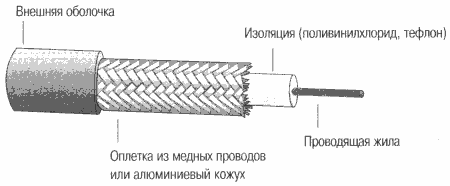

# Волоконно-оптические кабели: основные типы и их характеристики

Состоит из центральной стеклянной нити (световода) толщиной в несколько микрон, покрытой сплошной стеклянной оболочкой, обладающей меньшим показателем преломления, чем световод. Распространяясь по световоду, лучи света не выходят за его пределы, отражаясь от покрывающего слоя 
оболочки. Все это в свою очередь спрятано во внешнюю защитную оболочку.

Передача электромагнитной энергии по световоду основана на эффекте полного внутреннего отражения. Лучи света, входя в сердцевину двухслойного световода, с торца удерживаются внутри сердечника за счет полного внутреннего отражения на границе двух сред с различными показателями преломления. Для реализации этого эффекта формируются два слоя из кварцевого стекла с различными показателями преломления. 

Различают 2 вида оптоволокна:

* однодомовый кабель
* многодомовый кабель

"Мода" - это описание режима распространения световых лучей по сердечнику кабеля. В одномодовом кабеле (SMF-Single Mode Fiber) сердечник очень мал по диаметру, всего 5-10 мкм, что соизмеримо с длиной световой волны. Световые лучи распространяются по сердечнику, почти не отражаясь от внешнего проводника, вдоль оптической оси световода. У этого типа кабеля очень широкая полоса пропускания - сотни гигагерц на километр. Для одномодового кабеля требуется изготовление тонких качественных волокон, и поскольку это сложный технологический процесс, соответственно, это делает достаточно дорогим и сам кабель. Еще один недостаток этого вида кабеля - значительные энергозатраты, которые возникают при направлении пучка света в волокно такого маленького диаметра. В связи с этим в одномодовых кабелях в качестве источника света используются полупроводниковые лазеры. Они работают на длине волн 1300 и 1550 нм и модулируют световой поток с частотами 10 ГГц и выше.  Также при использовании лазеров в одномодовых кабелях потери энергии меньше, чем в многомодовых при использовании в них светодиодов как источников света.

В многомодовых кабелях сердечник более широк, нежели в одномодовом. Его легче изготовить технологически, а это значит, что многомодовый кабель дешевле. Основные общеупотребительные кабели этого типа, утвержденные стандартом, это 62,5/125 мкм и 50/125 мкм. Первое число перед дробью - диаметр сердечника, число же справа от дроби указывает размер внешнего проводника. В многомодовых кабелях во внутреннем проводнике одновременно находится несколько световых лучей. Эти лучи отражаются от внешнего проводника под различными углами. Угол отражения луча и называется модой. У многомодовых кабелей полоса пропускания составляет 500-800 МГц/км. Полоса пропускания сужается из-за потерь световой энергии при отражении лучей и при интерференции лучей разных мод. Источниками света в многомодовых кабелях служат светодиоды. Они излучают свет с длиной волны 850 нм и 1300 нм. Светодиоды с длиной волны 850 нм существенно дешевле, чем с 1300 нм, но полоса пропускания для кабеля
с длиной волн 850 нм, например 200 МГц/м вместо 500 МГц/м.

Стоимость самого волоконно-оптического кабеля примерно равна стоимости кабеля на витой паре, но стоимость монтажных работ обходится намного дороже из-за дорогого монтажного оборудования и трудоемкости соединения кабеля с разъемом. При некачественном соединении резко уменьшается полоса пропускания оптоволоконного кабеля и линии на его основе. 

Превалирующее большинство компаний, предоставляющих услуги доступа в Интернет, используют в своей работе оптоволокно и витую пару. Основные
трассы между зданиями строятся на основе оптоволоконного кабеля, что обеспечивает высокую скорость на этих участках, а непосредственно к квартире пользователя подводится неэкранированная витая пара пятой категории, характеристики которой вполне отвечают требованиям на 
этом участке сети. Такой вариант позволяет обеспечить сочетание невысокой стоимости подключения, так как монтажные работы, связанные с подключением по витой паре, не требуют больших усилий и приемлемой скорости работы в Интернете. Именно этот способ подключения через локальные сети можно считать наиболее современным, подключение же по коаксиальному кабелю постепенно уходит в прошлое в силу своей высокой стоимости, при том, что качество связи не выше, чем при работе через сочетание "оптоволокно - витая пара".

## Usefull links

* http://files.school-collection.edu.ru/dlrstore/39131523-5991-11da-8314-0800200c9a66/default_10_321.pdf